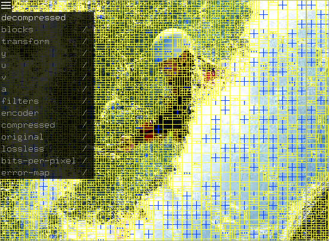

# WebP 2

WebP 2 is the successor of the WebP image format, currently in development. It
is not ready for general use, and the format is not finalized so changes to the
library can break compatibility with images encoded with previous versions.
USE AT YOU OWN RISK!

This package contains the library that can be used in other programs to encode
or decode Webp 2 images, as well as command line tools.

See http://developers.google.com/speed/webp for the first version of WebP .

[TOC]

## Building

### Prerequisites

A compiler (e.g., gcc 6+, clang 7+ or Microsoft Visual Studio 2017+ are
recommended) and CMake.

On a Debian-like system the following should install everything you need for a
minimal build:

```shell
$ sudo apt-get install build-essential cmake
```

### Compiling

```shell
$ mkdir build && cd build
$ cmake ..
$ make -j
```

Configuration options:

*   `WP2_ENABLE_SIMD`: enable any SIMD optimization.
*   `WP2_ENABLE_BITTRACE`: enable tracing.

For additional options see:

```shell
$ cmake .. -LH
```

## Binaries

### cwp2

`cwp2` is a tool to encode images in webp2.

Usage:

```shell
$ cwp2 in_file [options] [-o out_file]
```
Example for a single image:

```shell
$ cwp2 -q 70 input.png -o output.wp2
```

Example for an animation, with list of frames and durations in ms:

```shell
$ cwp2 -q 70 -f frame1.png 10 frame2.png 20 frame3.png 5 -o output.wp2
```

Important options:

|      Flag     | Default value |                 Description                 |
|--------------------|:---:|--------------------------------------------------|
| `-o <string>`      |     | output file path                                 |
| `-q <float>`       | 75  | image quality factor \[0=lossy : 100=lossless\]* |
| `-alpha_q <float>` | 100 | alpha quality factor \[0=lossy : 100=lossless\]* |
| `-speed <int>`     | 5   | compression effort \[0=fast : 9=slower/better\]  |
| `-f [<str> <int>]` |     | create an animation (alternate image, duration)  |

\* The quality factor range corresponds to:

|   Quality factor   | Meaning                                                 |
|:------------------:|---------------------------------------------------------|
|         0          | Lossy compression, smallest file size and worst quality |
|        ...         | Lossy compression                                       |
|         95         | Lossy compression, biggest file size and best quality   |
|         96         | Near-lossless compression (maximum preprocessing)       |
|        ...         | Near-lossless compression                               |
|         99         | Near-lossless compression (minimum preprocessing)       |
|        100         | Lossless compression                                    |

Use `cwp2 -h` to see a full list of available options.

### dwp2

`dwp2` is a tool to decode webp2 images.

Usage:

```shell
$ dwp2 in_file [options] [-o out_file]
```

Use `dwp2 -h` to see a full list of available options.

### vwp2

`vwp2` is a visual inspection and debugging tool. You need OpenGL and GLUT to
build it.



To open any image (jpeg, png, etc.) then compress it in WebP 2 and view the
result:

```shell
$ vwp2 in_file...
```

`vwp2` takes most of the same flags as `cwp2`, e.g. `-q` for quality, `-speed`,
and so on. Encoding parameters can also be changed dynamically in the tool using
key bidings.

Press `h` to a list of key bindings.

Use the top left menu or press `v` and `shift+v` to cycle between views.

Press `i` to show or hide info (note this hides the menu).

To view an already compressed file, use:

```shell
$ vwp2 -d path/to/image.wp2
```

### rd_curve

rd_curve is a command-line tool for compressing images at multiple quality
levels using different codecs (webp2, webp, jpeg, av1) to create rate-distortion
curves (rd curves). An rd curve is a plot of distortion (difference between
source and encoded image) vs bits per pixel, for different quality settings.

```shell
$ rd_curve [options] input_file
```

`rd_curve` takes most of the same flags as `cwp2`, e.g. `-q` for quality,
`-speed`, and so on.

By default, only the webp2 codec is used. Use `-webp`, `-jpeg` or `-av1` flags
to add other codecs.

By default, results are printed as plain text on standard output.

With the `-html` flag, rd_curve outputs an html file. It also saves compressed
images (turns on the `-save` option). Use the `-save_folder` option to set the
directory where images are saved.

```shell
$ rd_curve input.png -webp -jpeg -av1 -html -save_folder $(pwd) > myfile.html
```

### get_disto

`get_disto` computes the difference between two images (typically the compressed
file and the original file)

```shell
$ get_disto [options] compressed_file orig_file
```

`get_disto` outputs in order:

- compressed file size
- overall PNSR (or other metric, if specified through flags)
- PSNR (or other metric) for A, R, G and B channels, in order
- compressed file bits per pixel

## API

### Encoding API

Encoding functions are available in the header `src/wp2/encode.h`.

#### Encoding an image

```c++
#include "imageio/image_dec.h"
#include "src/wp2/base.h"
#include "src/wp2/encode.h"

WP2::ArgbBuffer input_buffer;
WP2Status status = WP2::ReadImage("path/to/image.png", &input_buffer);
if (status != WP2_STATUS_OK) { /* handle error */ }
WP2::EncoderConfig config;
config.quality = 70;
WP2::MemoryWriter writer;
status = WP2::Encode(input_buffer, &writer, config);
if (status != WP2_STATUS_OK) { /* handle error */ }
// do something with writer.mem_
```

#### Encoding an animation

```c++
#include "imageio/image_dec.h"
#include "src/wp2/base.h"
#include "src/wp2/encode.h"

WP2::ArgbBuffer frame1, frame2;
WP2Status status = WP2::ReadImage("path/to/frame1.png", &frame1);
if (status != WP2_STATUS_OK) { /* handle error */ }
status = WP2::ReadImage("path/to/frame2.png", &frame2);
if (status != WP2_STATUS_OK) { /* handle error */ }

WP2::AnimationEncoder encoder;
status = encoder.AddFrame(frame1, /*duration_ms=*/100);
if (status != WP2_STATUS_OK) { /* handle error */ }
status = encoder.AddFrame(frame2, /*duration_ms=*/50);
if (status != WP2_STATUS_OK) { /* handle error */ }

WP2::EncoderConfig config;
config.quality = 70;
WP2::MemoryWriter writer;
status = encoder.Encode(&writer, config, /*loop_count=*/1);
if (status != WP2_STATUS_OK) { /* handle error */ }
// do something with writer.mem_
```

### Decoding API

Decoding functions are available in the header `src/wp2/decode.h`.

#### Simple decoding

This is mainly just one function to call:

```c++
#include "src/wp2/base.h"
#include "src/wp2/decode.h"

const std::string data = ...
WP2::ArgbBuffer output_buffer;
WP2Status status = WP2::Decode(data, &output_buffer);
```

If the file is a WebP 2 animation, `output_buffer` will contain the first frame.

Please have a look at the file `src/wp2/decode.h` for further details.

#### Animation decoding

To decode all the frames of an animation, the more advanced `Decoder` API can be
used. See tests/test_decoder_api.cc for common use cases.

```c++
WP2::ArrayDecoder decoder(data, data_size);
uint32_t duration_ms;
while (decoder.ReadFrame(&duration_ms))  {
  // A frame is ready. Use or copy its 'duration_ms' and 'decoder.GetPixels()'.
}
if (decoder.GetStatus() != WP2_STATUS_OK) { /* error */ }
```

#### Incremental decoding

If you want to start decoding before all the data is available, you can use the
`Decoder` API. Use an `WP2::ArrayDecoder` if the data is stored in an array that
progressively gets larger, with old bytes still available as new bytes come in.
Use a `WP2::StreamDecoder` if data is streamed, with old bytes no longer
available as new bytes come in. You can also subclass `WP2::CustomDecoder` to
fit your needs. See tests/test_decoder_api.cc for common use cases.

Below is an example with `WP2::StreamDecoder`.

```c++
WP2::StreamDecoder decoder;
while (/*additional data is available in some 'new_data[]' buffer*/) {
  decoder.AppendInput(new_data, new_data_size);
  while (decoder.ReadFrame()) {
    // ReadFrame() returns true when an entire frame is available
    // (a still image is considered as a single-frame animation).
    // The canvas is stored in GetPixels() till the next call to ReadFrame().

    // Use the whole GetPixels().
  }
  if (decoder.Failed()) break;
  if (!decoder.GetDecodedArea().IsEmpty()) {
    // Use the partially GetDecodedArea() of GetPixels().
  }
}
if (decoder.GetStatus() != WP2_STATUS_OK) { /* error */ }
```

## Development

### Contributing

See [CONTRIBUTING.md](CONTRIBUTING.md) for details on how to submit patches.

### Coding conventions and style

* Code must follow the
  [Google C++ style guide](https://google.github.io/styleguide/cppguide.html)
  unless local style differs.

* `const` is used for variables everywhere possible, including for pointers
  in function declarations. Input parameters use const references.

  ```c++
  void DoSomething(const WP2Obj1& const input, WP2Obj1* const out)
  ```

* Do not use C++ exceptions.

* Do not use std containers in the main library, e.g. no std::vector/set/map
  (but they can be used in tests). For vectors, use WP2::Vector instead.

* Use uint32_t for sizes, width, height, loop indices, etc.

* Most functions should return a WP2Status

### Google Test Integration

A part of testing support is built using Google Test. To enable it the
`WP2_ENABLE_TESTS` cmake variable must be turned on at cmake generation time (ON
by default), and the `GTEST_SOURCE_DIR` cmake variable must be set to the path
of the Google Test source directory (../googletest by default):

```shell
$ git clone https://github.com/google/googletest.git path/to/googletest
$ cmake path/to/wp2 -DWP2_ENABLE_TESTS=ON -DGTEST_SOURCE_DIR=path/to/googletest
```

To run the tests you can use ctest after the build:

```shell
$ make
$ ctest
```

## Discussion

Email: webp-discuss@googlegroups.com

Web: https://groups.google.com/forum/#!forum/webp-discuss
